# Damage Pipeline

Authoritative flow for how a single attack action resolves from skill selection to
HP reduction. Every node maps to a specific piece of code — update both together.

---

## Flow diagram

```mermaid
flowchart TD
    A([Actor's turn]) --> FS{"Action is\na Focus skill?"}

    FS -- yes --> FK["Deduct FocusCost from Focus bar\nGrant Focused buff\nAction refunded → player acts again"]
    FK --> A

    FS -- no --> B

    subgraph PRE["Pre-hit resolution  (once per action)"]
        B["Resolve effective hit count\n· AGI-derived  OR  skill BaseHits\n· Slow status: AGI hits halved"]
        B --> FC{"Actor has Focused buff\nAND skill is IsFocusCompatible?"}
        FC -- yes --> FE["Consume Focused buff\nEmit 'sharpens' event\neffectiveHits += FocusEffectValue\n(ExtraHit or ExtraProjectile)"]
        FC -- no  --> GM
        FE --> GM["Compute empowerMult\n= DamageDealtMultiplier from active effects"]
        GM --> D{"Fury empowered?\n(bar = 100, non-basic skill)"}
        D -- yes --> E["empowerMult × 1.5 · Fury bar → 0"]
        D -- no  --> F
        E --> F["Snapshot actorIsDizzy\n(Disruption bar ≥ 50)\n\nSnapshot damageTakenMult\n(target's DamageTakenMultiplier\nfrom active effects)"]
    end

    F --> LOOP

    subgraph LOOP["Per-hit loop  (repeated effectiveHits times)"]

        subgraph PIPE["DamageCalc.Compute  — full audit trail in DamageResult.Steps"]
            L1["Layer 1 — Base\nΣ (stat × scaling) × DamageMultiplier × empowerMult × perHitMult\n± variance (±20 % of stat base)"]
            L1 --> L2["Layer 2 — Resistance\neffectiveResistance = target.Resistance − actor.Penetration\ncapped at 90  →  always ≥ 10 % damage lands\n× (1 − resistance / 100)"]
            L2 --> L3["Layer 3 — OutgoingTypeMult\nactor's per-type dealt multiplier from active effects\nskipped when = 1.0"]
            L3 --> L4["Layer 4 — IncomingTypeMult\ntarget's per-type taken multiplier from active effects\nskipped when = 1.0"]
            L4 --> L5["Layer 5 — AttackerOutput\nDizzy → × 0.8\nskipped when = 1.0"]
            L5 --> L6["Layer 6 — DamageTaken\nflat defender-side multiplier from active effects\nskipped when = 1.0"]
            L6 --> SUM["totalDamage = Σ FinalDamage\nacross all DamageComponents"]
        end

        SUM --> BAR{"Target has Barrier?"}
        BAR -- yes --> BABSORB["Barrier absorbs min(barrier, totalDamage)\nRemainder applied to HP"]
        BAR -- no  --> HP["Full totalDamage applied to HP"]
        BABSORB --> DEAD
        HP --> DEAD{"Target HP ≤ 0?"}
        DEAD -- yes --> KILL([Target defeated · break hit loop])
        DEAD -- no  --> MORE{"More hits?"}
        MORE -- yes --> L1
        MORE -- no  --> POST
    end

    POST([End of action]) --> W["Post-action\nTick active effects · Fury gain\nThermal & Disruption buildup · Reactions"]

    style PRE  fill:#1a1a2e,stroke:#4e4e8f,color:#ccc
    style LOOP fill:#12232e,stroke:#4e8f6e,color:#ccc
    style PIPE fill:#0f1b25,stroke:#2e6f8f,color:#ccc
```

---

## Traceability table

Every node in the diagram maps to a named location in code. When you change the
pipeline, update the matching row here and the Mermaid above.

| Diagram node | `DamageStep` name in `DamageResult.Steps` | Code location |
|---|---|---|
| Focus skill branch | *(not in pipeline)* | `InteractiveBattleSession.ExecuteAction` — `if (skill.IsFocusSkill)` block |
| Hit count (AGI / BaseHits) | *(not in pipeline)* | `InteractiveBattleSession.ExecuteAction` — `effectiveHits` resolution block |
| Focus ExtraHit/ExtraProjectile | *(not in pipeline)* | `InteractiveBattleSession.ExecuteAction` — `if (isFocusEmpowered && ...)` |
| Fury empowerment | *(not in pipeline)* | `InteractiveBattleSession.ExecuteAction` — `isFuryEmpowered` block |
| Dizzy snapshot | *(not in pipeline)* | `InteractiveBattleSession.ExecuteAction` — `actorIsDizzy` + `attackerOutputMult` |
| DamageTaken snapshot | *(not in pipeline)* | `InteractiveBattleSession.ExecuteAction` — `GetDamageTakenMultiplier` + `defenderDamageTakenMult` |
| **Layer 1 — Base** | `"Base"` | `DamageCalc.cs` — Layer 1 block |
| **Layer 2 — Resistance** | `"Resistance"` | `DamageCalc.cs` — Layer 2 block |
| **Layer 3 — OutgoingTypeMult** | `"OutgoingTypeMult"` | `DamageCalc.cs` — Layer 3 block |
| **Layer 4 — IncomingTypeMult** | `"IncomingTypeMult"` | `DamageCalc.cs` — Layer 4 block |
| **Layer 5 — AttackerOutput** | `"AttackerOutput"` | `DamageCalc.cs` — Layer 5 block |
| **Layer 6 — DamageTaken** | `"DamageTaken"` | `DamageCalc.cs` — Layer 6 block |
| Barrier absorption | *(not in pipeline)* | `InteractiveBattleSession.ExecuteAction` — barrier block after `DamageCalc.Compute` |

> `DamageStep` names are the string keys you query in `DamageResult.Steps` and in the
> BattleSandbox hit log. They are the canonical identifiers — keep diagram, table, and
> code strings in sync.

---

## Rules for adding a new layer

1. Append a step block inside `DamageCalc.Compute` below the last layer comment.
2. Use a `// ── Layer N: Name ──` comment and a `new DamageStep("Name", ...)` call.
3. Add a row to the traceability table above with the exact `DamageStep` name.
4. Update the Mermaid diagram.

Only add to `DamageCalc.Compute` things that are **per-component multipliers**.
HP routing (barrier) and hit-count mechanics stay in `ExecuteAction`.
